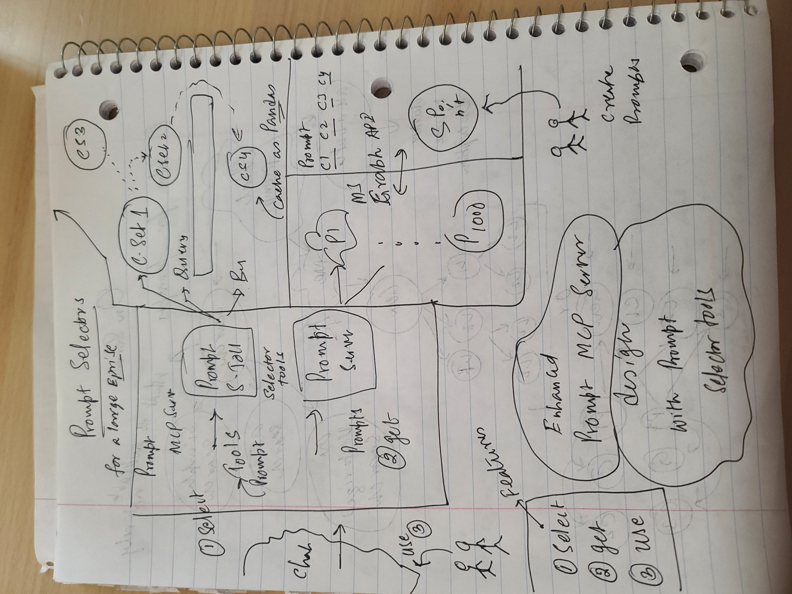

# Scalable Prompt Management in MCP Architectures: Using Tool Servers and Extensions

**Managing thousands of prompts** within an MCP-enabled system presents challenges for scalability, user experience, and system design. 

This article explores how **MCP extensions** or/and the introduction of a **dedicated MCP Tool Server** may address these challenges.

# Table of Contents

1. Introduction
2. Challenges with Standard MCP Listing
3. Extending MCP: Best Practices and Design Principles
4. Architectural Solution: Introducing an MCP Tool Server
5. Comparative Analysis of Solutions
6. Detailed Architecture Overview
7. Advantages and Tradeoffs
8. Implementation Details
9. Extending Further: Future-Proofing the Platform
10. Conclusion
11. References

# Introduction

In an enterprise environment, it is expected that thousands of reusable prompts will accumulate over time, forming a critical part of operational workflows. However, MCP servers, by standard design, list all available prompts through the `list_resources` endpoint without any native filtering specification. This can make direct usage impractical at scale. This article explores solutions centered on protocol extensions and perhaps introduction of an MCP Tool Server to manage and retrieve large prompt sets through a selection process.

# Challenges with Standard MCP Listing

Scaling Issues with Thousands of Prompts arise when users must scroll, filter, or search manually through massive datasets. Practical User Experience Problems may overwhelming UI lists, include high latency, and increased client memory load.

# Extending MCP: Best Practices and Design Principles

MCP servers were intentionally designed to be lightweight, providing basic resource listing capabilities without embedded filtering mechanisms.

MCP explicitly allows extensions as part of its design philosophy. Servers can extend the basic protocol to introduce new features like filtering, additional metadata, or search capabilities without breaking the behavior expected by standard clients.

This openness allows enterprises to extend the protocol to meet real-world operational needs. In particular, introducing server-side filtering extensions can significantly enhance the selection process, enabling users to quickly locate the prompts they need from thousands of reusable assets without overwhelming the client or degrading the user experience.

**Note: However extending MCP should be additive and backward-compatible.**

**Why MCP Was Designed to Be Extensible**:

- It allows vendors and enterprises to adapt the protocol to practical needs without breaking standard clients.

**Types of Safe Extensions**:

- **Adding Fields**: Append non-breaking metadata fields to resources.
- **Adding Query Parameters**: Allow server-side filtering with parameters like `x_filter_tag`, `x_filter_name`.
- **Adding New Endpoints**: Introduce services like search without modifying `list_resources`.

**Recommended Namespacing**:

- Use the `x_` prefix (e.g., `x_filter_tag`) to avoid collisions with future official MCP versions.
- Enterprises may also adopt organization-specific namespacing such as `x_company1_filter_tag` to clearly distinguish internal extensions and maintain clarity across systems.

**Maintaining Compatibility**:

- Never alter the meaning of core fields like `id` or `resource_type`.
- Clients unaware of extensions should continue functioning normally.

# Architectural Solution: Introducing an MCP Tool Server

An alternative and highly effective solution is to introduce a separation of concerns, where the Prompt Server focuses purely on storage while a dedicated Tool Server manages smart access patterns. The philosophy behind this design is to preserve the simplicity and reliability of the prompt repository while enabling flexible, scalable, and sophisticated search and retrieval operations through the Tool Server. This approach aligns with MCP's extensibility philosophy, allowing enterprises to build advanced capabilities without compromising the core protocol integrity.

**Motivation for a Dedicated Search Layer**:

- Better scalability
- Richer search capabilities
- Modularity for system evolution

# Comparative Analysis of Solutions

**Approach 1: Extending MCP Server for Filtering**

| Pros | Cons | Suitable for |
|:---|:---|:---|
| Simple extension of existing server | Filtering still constrained to resource listing model | Smaller prompt sets (under 1,000 prompts) |
| Minimal infrastructure changes | Server load increases with complex filters | Moderate-sized prompt stores |
| Easy to implement basic tag or name filters | Complex search (full text, semantic) difficult to retrofit | Quick wins for targeted filtering |

**Approach 2: Introducing a Tool Server**

| Pros | Cons | Suitable for |
|:---|:---|:---|
| Full flexibility in search, recommendation, faceting | Additional infrastructure and operational overhead | Large prompt sets (thousands or more) |
| Can integrate full text search engines or embeddings | Requires frontend clients to handle tool discovery and invocation | Advanced UX needs (autocomplete, smart search) |
| Decouples search load from prompt storage | Sync mechanisms needed for consistency | Enterprise-wide deployments and evolving search needs |

# Detailed Architecture Overview

**MCP Prompt Server**:

- Stores prompt resources
- Responds to basic MCP operations (list, retrieve)

**MCP Tool Server**:

- Registers "search" and "recommendation" tools
- Processes intelligent filtering, tagging, recommendations

**Frontend Interaction Patterns**:

- Frontend discovers and invokes search tools
- Search tools return refined sets of prompts
- Frontend fetches full prompt details via prompt server if needed

# Advantages and Tradeoffs

**Pros**:

- Separation of concerns
- Scalable architecture
- Support for complex search and recommendation mechanisms

**Cons**:

- Slightly more complex infrastructure
- Client applications must be designed to understand and use tools
- Need for synchronization between prompt updates and search indexes

# Implementation Details

**Designing Search Tools**:

- `search-prompts-by-tag`: Input a tag, receive matching prompts
- `search-prompts-by-name`: Input name text, receive matches
- `recommend-prompts-for-task`: Input a task description, receive suggested prompts

**Example Input/Output Contracts**:

- Structured JSON input (e.g., `{ "tag": "customer-support" }`)
- Structured list output with prompt IDs, names, and metadata

**Security and Performance**:

- Limit maximum results per search
- Authorize users to ensure only accessible prompts are searchable

# Extending Further: Future-Proofing the Platform

**Full Text Search and Semantic Retrieval**:

- Integrate search engines like ElasticSearch or Vespa
- Add semantic matching with embeddings for richer recommendations

**Embeddings-Based Search Options**:

- Precompute embeddings for prompts
- Offer similarity search tools

**Handling Resource Updates and Indexing Sync**:

- Implement background sync jobs
- Provide versioned prompts if updates are frequent

<!-- ********************* -->
# Visual Architecture
<!-- ********************* -->

High level diagram (pencil drawn, for now)

## Features

1. Browse and select prompts on demand by end users
2. Get the body of the prompts chosen
3. Use the prompts then in the GenAI application like a chat bot

## Components

1. An independent Prompt Store: Where employees can create/share/udpate their reusable prompts. These prompts can be organized with any number of attributes such as department, area, application, etc.
2. An MCP Prompt Server: A traditional MCP server that lists prompts and provide text for each prompt. This is a linear list. 
3. An MCP Prompt Selector Tools Server: An MCP Tool server that can provision a variety of search tools to indicate the prompts that are to be further selected by an end user.
4. Chat: A client application where users make use of the prompts

## Prompt Store

1. A stand alone system with ux and database for users to create prompts and categorize them in to several private or public buckets.
2. Allows multiple attributes on the prompts including role based security, allocation
## Prompt MCP Server

1. A traditional MCP server
# Conclusion

Given the scale and complexity of managing thousands of prompts in enterprise environments, implementing structured approaches like MCP server extensions or introducing a dedicated MCP Tool Server is not over-architecting but rather a necessary evolution to maintain efficiency and scalability.​

## Why These Approaches Are Warranted

**Scalability Needs:** As organizations accumulate extensive prompt libraries, the lack of native filtering in MCP servers can hinder prompt discovery and usage. Extensions and tool servers address this by enabling efficient filtering and management.​

**Enhanced User Experience:** Implementing filtering mechanisms improves the usability of prompt libraries, allowing users to quickly find relevant prompts without sifting through irrelevant ones.​

**Modularity and Maintainability:** Separating concerns by introducing a Tool Server allows for modular development, where prompt storage and retrieval logic can evolve independently, facilitating easier maintenance and updates.​

**Alignment with MCP Philosophy:** MCP is designed to be extensible. Utilizing extensions and additional servers aligns with its intended use, promoting flexibility and adaptability in various use cases.​

## Considerations to Avoid Over-Engineering

**Assess Current Needs:** If the prompt library is relatively small and manageable, implementing complex architectures may not be necessary.​

**Incremental Implementation:** Start with basic extensions to address immediate needs and scale up to more complex solutions like a Tool Server as requirements grow.​

**Resource Evaluation:** Consider the available resources and expertise to implement and maintain additional infrastructure. Ensure that the benefits outweigh the costs.​

## So

Implementing MCP server extensions and introducing a Tool Server are justified strategies to manage large prompt libraries effectively. These approaches enhance scalability, user experience, and maintainability, aligning with MCP's extensible design. However, it's essential to assess the organization's specific needs and resources to avoid unnecessary complexity

# References

1. [Basics of MCP prompts from modelcontextprotocol.io, the official site](https://modelcontextprotocol.io/docs/concepts/prompts)
2. [A detailed medium article like a tutorial](https://medium.com/@nimritakoul01/the-model-context-protocol-mcp-a-complete-tutorial-a3abe8a7f4ef). Talks registry API, Remote servers, oauth 2.0, has a few references.
3. [Building agents, from anthropic](https://www.anthropic.com/engineering/building-effective-agents)
4. [Supabase example of an MCP server and what is possible](https://supabase.com/docs/guides/getting-started/mcp#claude-desktop)
5. [Regitry API discussion at the core site](https://github.com/orgs/modelcontextprotocol/discussions/159)