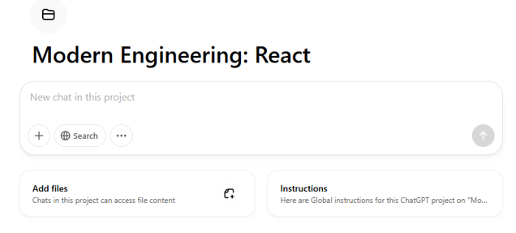

<!-- ********************* -->
# Working with Prompts in ChatGPT
<!-- ********************* -->

The 2 mechanisms I have used

1. As a Custom GPT
2. As "additional instructions to a Project"

<!-- ********************* -->
# As a custmo GPT
<!-- ********************* -->

1. This is the most obvious way
2. When you create a new custom GPT, you can supply all the global instructions that custom GPT

<!-- ********************* -->
# As a project
<!-- ********************* -->

1. when you create a project
2. Projects allow you to group your related threads
3. So the "project" is a nice place to add such global instructions

The following is where that "button" is available on a project (as Mar 2025), and this may change with future releases

<!-- ********************* -->
# Some useful system prompts
<!-- ********************* -->
1. [Language prompt](language-prompt-v1.txt). Lot of useful hints to work with languages, such as synonyms, conjugations, rewrites etc.
2. [Creating a .md file in the right structre](chatgpt-project-system-prompt.txt). An example of a Project level prompt. As of now contains how to create a .md file in the right structure.

