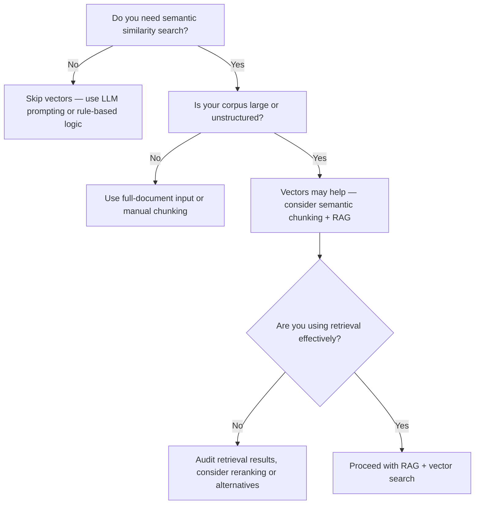

<!-- ********************* -->
# When Not to Use Vectors in GenAI Applications
<!-- ********************* -->

Note: Created from conversations with ChatGPT. (Consider it a draft!)

## Table of Contents

1. Introduction
2. Common Misuses of Vector Embeddings
3. Signs You're Overusing Vectors
4. What to Use Instead
5. Decision Flowchart
6. Additional Caution Areas
7. Summary
8. What we are trying to prevent?
9. References

<!-- ********************* -->
# Introduction
<!-- ********************* -->

Vector embeddings are a cornerstone of modern GenAI workflows, especially for semantic search and Retrieval-Augmented Generation (RAG). However, they are often **overused or misapplied** in applications where simpler or more targeted techniques would perform better.

This article explores when **not** to use vector embeddings, what to consider before reaching for them, and better alternatives for common tasks.

<!-- ********************* -->
# Common Misuses of Vector Embeddings
<!-- ********************* -->

Vector search is frequently over-applied in cases such as:

- **Structured data extraction**: e.g., extracting invoice fields or contract details, where schema-aware extraction or prompting works better.
- **Text summarization**: Summarizing a single document doesn’t usually require vector search unless used in multi-doc contexts.
- **Text-to-SQL**: Translating natural language into queries typically benefits more from prompt engineering and schema-awareness than similarity retrieval.
- **Small corpora**: When the number of documents is limited, direct prompting or full-document ingestion by the LLM may be more efficient.

<!-- ********************* -->
# Signs You're Overusing Vectors
<!-- ********************* -->

1. You're retrieving chunks for every prompt regardless of context.
2. Your document set is static and small, but you still maintain a vector index.
3. You're treating vector search as a substitute for parsing, extraction, or reasoning.
4. Your retrieved chunks frequently include irrelevant or low-signal content.

<!-- ********************* -->
# What to Use Instead
<!-- ********************* -->

| Task Type                     | Better Alternative                                 |
|------------------------------|----------------------------------------------------|
| Structured Data Extraction   | Prompt templates, schema-aware models              |
| Text Summarization           | Direct LLM summarization via prompt or tool usage  |
| Text-to-SQL                  | Guided prompting, function calling, structured parsers |
| QA on Small Document Sets    | Full-document ingestion or direct context prompts  |
| Document Classification      | Zero/few-shot classification with LLMs             |

<!-- ********************* -->
# Decision Flowchart
<!-- ********************* -->

<!-- ********************* -->
# Additional Caution Areas
<!-- ********************* -->

Beyond the obvious cases, here are other categories where vector use should be reconsidered:

### 1. Deterministic Lookups or Entity Resolution
- Use cases like product catalog matching, name disambiguation, or ID resolution require precision.
- Vector similarity is fuzzy and may return near-matches that are incorrect.
- ✅ Use: rule-based matching, fuzzy string search (e.g., `RapidFuzz`, `trie` structures).

### 2. Form-Filling and Compliance Tasks
- Use cases that involve pulling structured data from contracts or invoices.
- These demand strict field mapping — not semantic guesswork.
- ✅ Use: Template-based extraction, few-shot prompts, function calling.

### 3. Multi-Step Reasoning or Chain-of-Thought Workflows
- When tasks involve sequential logic or decision chains, retrieval may add confusion.
- ✅ Use: Structured prompting, agents, or scratchpad-style workflows.

### 4. Tight Context Tasks (e.g., full-doc summarization)
- Splitting context into chunks can degrade comprehension.
- ✅ Use: Hierarchical summarization, long-context models, sliding windows.

### 5. High-Explainability Applications
- Regulated domains (healthcare, finance) may need auditable output.
- Vector matching lacks transparency.
- ✅ Use: Rule-based systems or symbolic search.

### 6. Document Classification
- Embeddings may group topically similar but label-irrelevant docs.
- ✅ Use: LLM-based zero-shot classification or fine-tuned classifiers.

### Tip:
> Vectors ≠ memory. Don’t use vector search to track intermediate reasoning steps or internal state.

<!-- ********************* -->
# Summary
<!-- ********************* -->

While vector embeddings are a powerful tool, they are **not universally applicable**. Many GenAI applications overuse them in places where prompt engineering, schema-aware tools, or full-document LLM input would be simpler and more effective.

✅ Use vectors when:
- Your task involves ambiguity or fuzzy matching.
- Your corpus is large, diverse, or semi-structured.

🚫 Consider alternatives when:
- Your task requires structured reasoning, deterministic output, or simple extraction.
- Your data set is small, known, or static.

Be intentional about tool choice to reduce complexity, avoid hallucinations, and improve overall GenAI effectiveness.

<!-- ********************* -->
# What we are trying to prevent through these guidelines?
<!-- ********************* -->

When we provide guidelines, they must "prevent" tangibly identifiable inefficiences.

## 1. RAG is about Retrieval, not Vectors
Not every RAG use case requires semantic search. Retrieval can be powered by metadata filters, keyword search, APIs, or structured queries. Treat vectors as one of several retrieval tools—not the default.

## 2. Don’t Vectorize Structured Data
Structured data is already optimal for querying. Converting it into embeddings typically reduces fidelity and introduces unnecessary layers. Keep structured sources (e.g., SQL, JSON APIs) in their native form for maximum precision.

## 3. Prefer Direct Text and APIs Where Applicable
If the data is readily accessible and well-structured, use it directly. Many RAG pipelines perform better when fed relevant raw text from trusted sources, rather than relying on fuzzy embedding matches.

## 4. Avoid Preemptive Enterprise-Wide Vectorization
Vectorizing all organizational content without defined use cases often mirrors past over-investments in data lakes or warehouses. This leads to cost, complexity, and governance challenges. Build vector pipelines in response to real application needs—not speculative infrastructure planning.

## 5. Evaluate Retrieval Effectiveness
Many teams skip rigorous evaluation of their retrieval systems. Poor chunking or low-quality embeddings can silently degrade downstream performance. Introduce quality gates like retrieval precision, recall, MRR, and chunk audit logs.

## 6. Avoid Vector Creep
Once vector infrastructure exists, there's a tendency to apply it inappropriately across unrelated use cases. Resist embedding for problems that don't involve ambiguity, natural language, or true semantic fuzziness.

## 7. Plan for Lifecycle Management
Vectors are not static assets. Embeddings can become stale over time as content evolves. Establish policies for re-indexing, refreshing with updated embedding models, and version control.

## 8. Watch for Overfitting to Data Artifacts
Vector search solutions can appear to work well during testing, especially when evaluation is based on narrow or familiar prompts. But if retrieval relies too heavily on specific phrasing or structure in your documents, the solution may not generalize. This is a form of overfitting. 
- ✅ Encourage validation using real-world or blind prompts, and test against future drift or cross-team scenarios.
- ✅ Avoid tuning pipelines exclusively to a fixed dataset without diverse user inputs.

### Summary Table

| Principle                          | Preferred Practice                                      |
|-----------------------------------|----------------------------------------------------------|
| Retrieval-first thinking          | Choose the best method for the use case, not default vectors |
| Preserve structured data as-is    | Avoid vectorizing relational or tabular sources          |
| Use text or APIs where simpler    | Don’t route around deterministic sources unnecessarily   |
| Just-in-time over just-in-case    | Build vector pipelines for concrete problems, not broadly scoped prep work |
| Measure before scaling            | Use metrics to validate retrieval performance            |
| Be vigilant against misuse        | Apply vectors only to semantically fuzzy or ambiguous tasks |
| Generalize beyond test data       | Ensure solutions are robust, not just fitted to known inputs |

<!-- ********************* -->
# References
<!-- ********************* -->

1. [OpenAI Function Calling](https://platform.openai.com/docs/guides/gpt/function-calling): Guide to structured outputs.
2. [LangChain Output Parsers](https://docs.langchain.com/docs/components/output_parsers/): Tools for schema-aware parsing.
3. [Sentence Transformers](https://www.sbert.net/): Embedding models commonly used in semantic search.
4. [RAG for Knowledge-Intensive Tasks](https://arxiv.org/abs/2005.11401): The original RAG paper outlining retrieval-based generation.
5. [Mermaid Live Editor](https://mermaid.live/edit): Tool for creating and testing flowcharts like the one above.
6. [Revisiting Retrieval-Augmented Generation](https://arxiv.org/abs/2402.11750): A more recent paper that critically evaluates when and how RAG (and by extension vector retrieval) is beneficial.
7. [Don't Use RAG for Everything (Riley Goodside)](https://twitter.com/goodside/status/1747057173859885303): A practitioner’s perspective on RAG overuse and alternative strategies.
8. [RAG Isn’t Always the Answer – Latent Space Podcast](https://www.latent.space/p/vector-databases-are-not-a-moat): Discussion of tradeoffs and design decisions in vector-based pipelines.

